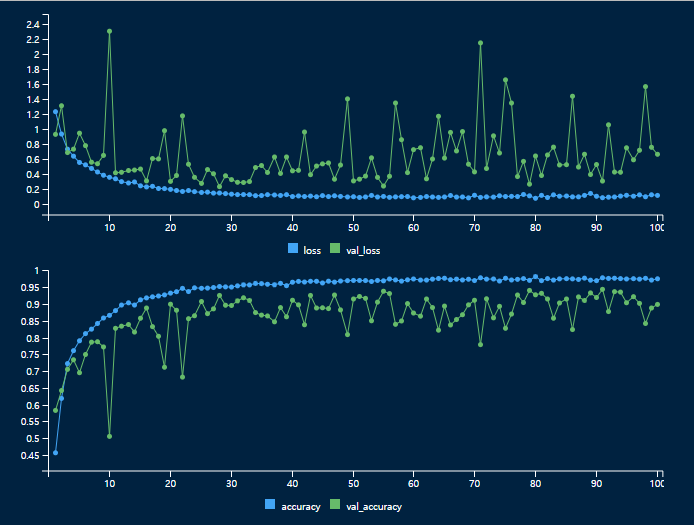

---
title:
output:
  html_document:
    theme: journal
    df_print: paged
    code_folding: show
  pdf_document: default
---

<style>
.html-widget {
    margin: auto;
}
</style>

<style type="text/css">
.main-container {
  max-width: 1250px;
  margin-left: auto;
  margin-right: auto;
  color: #082C6F;
  font-family: Arial;
  caption-side: bottom;
}
td, th {
 text-align: left;
 padding: 8px;
}
tr:nth-child(even) {
 background-color: #dddddd;
}
</style>

```{r setup, include=FALSE}
knitr::opts_chunk$set(echo = TRUE)
```

<br>

# <span style="color:#072B6F; font-weight:bold; font-size: 40px;">BRAIN TUMOR CLASSIFICATION USING CONVOLUTIONAL NEURAL NETWORK</span>

<br>

><p style = "color:#7BB6B3; font-weight: bold;">Computer vision techniques can now achieve near-human level accuracy in various image classification tasks</p>

<br>

<p style = "color:#082C6F; font-size: 20px !important; font-family: Arial;text-indent: 25px">
With the rapid advancement of AI, computer vision techniques have made immense progress, achieving near-human level accuracy in image classification. In this project, I focus on classifying three different kinds of brain tumor images using a Convolutional Neural Network (CNN) on a Brain Tumor MRI dataset. An initial model was created to establish a performance baseline, which was subsequently enhanced using various techniques such as image augmentation, batch normalization, and regulization, etc. Additionally, I experimented with pretrained models like VGG16 and DenseNet169 to explore how feature extraction and fine-tuning can further improve model performance. One primary advantage of using a CNN model is its ability to provide explainable predictions, unlike other deep neural networks often considered "black boxes." This project demonstrates how CNNs can help elucidate their predictions, thereby offering more transparent and interpretable results.</p>

<br>

## <span style="color: #7BB6B3; text-transform: uppercase;">Project Outline</span>

<ul style = "color:#7BB6B3; font-size:20px">
<li><a href="#data" style = "color: #7BB6B3">What is Brain Tumor Dataset?</a></li>
<li><a href="#preprocess" style = "color:#7BB6B3">Data Pre-processing</a></li>
<li><a href="#initial" style = "color: #7BB6B3"> Building the Initial Convolutional Neural Network from Scratch</a></li>
<li><a href="#augmentation" style = "color: #7BB6B3"> Adding Data Augmentation & Layer Dropout</a></li>
<li><a href="#feature_extraction" style = "color: #7BB6B3"> Leveraging Pretrained Model - Feature Extraction</a></li>
<li><a href="#fine_tuning" style = "color: #7BB6B3"> Fine Tuning using Pre-trained Model(VGG16, DenseNet169)</a></li>
<li><a href="#best_practice" style = "color: #7BB6B3"> Improving the Base Model with Best Practices</a></li>
<li><a href="#explainable" style = "color: #7BB6B3"> Explainable CNN - Intermediate Activation</a></li>
<li><a href="#heatmap" style = "color: #7BB6B3"> Explainable CNN - Visualizing Heatmaps</a></li>
<li><a href="#summary" style = "color: #7BB6B3"> Project Summary</a></li>
</ul>

<br>

### <span><a id="#" style="color: #7BB6B3;">Setting Up a Working Environment</a></span>
```{r, echo=TRUE, message = FALSE, warning = FALSE}
library(fs)
library(tensorflow)
library(keras)
library(tfdatasets)
library(zip)
library(imager)
library(ggplot2)
library(gridExtra)
library(reticulate)

setwd("/Users/dongheekoh/Documents/Data Science Training/portfolio/projects/Image_classfication_CNN/brain_tumor_CNN_project")

```

## <span><a id="data" style="color: #7BB6B3; text-transform: uppercase">What is Brain Tumor Dataset?</a></span>
<p style = "color:#082C6F; font-size: 20px;text-indent: 25px">This project utilized the Brain Tumor dataset that was made available on Kaggle. This dataset consists of magnetic resonance imaging (MRI) scans designed to assist in brain tumor classification. It includes images sorted into three types: glioma, meningioma, and pituitary tumors. The MRI images are provided in .jpg format, with varying resolutions and sizes, and are in grayscale, clearly showing brain structures and anomalies. This dataset is intended for building, training, and evaluating machine learning models, especially convolutional neural networks (CNNs), for image classification and medical diagnosis tasks. It serves as a valuable resource for developing algorithms that can aid in the automated diagnosis of brain tumors, thereby supporting early detection and treatment planning.</p> 


```{r,echo=TRUE, eval=FALSE ,fig.align='center'}
batch <- train_dataset %>% as_iterator() %>% iter_next()
str(batch)
c(images, labels) %<-% batch

display_image_tensor <- function(x, ..., max = 255, plot_margins = c(0,0,0,0)) {
  
  if(!is.null(plot_margins))
    par(mar=plot_margins)
  
  x %>% 
    as.array() %>%
    drop() %>%
    as.raster(max=max) %>%
    plot(..., interpolate = FALSE)
  }

par(mfrow = c(3,3))
for (i in 1:9) display_image_tensor(images[i,,,], plot_margins = rep(.5,4))

```

```{r, echo=FALSE, out.width="75%", fig.align='center'}

```

## <span><a id="preprocess" style="color: #7BB6B3; text-transform: uppercase">Data Pre-processing</a></span>
<p style = "color:#082C6F; font-size: 20px">Before developing an initial CNN model, the original dataset from Kaggle needed to be preprocessed emplying the following steps:</p> 
<ol style = "color:#082C6F; font-size:20px">
<li> Get a list of all image files (.jpg) in the file directory </li>
<li> Rename image files to include the brain tumor category as a prefix along with image index numbers</li>
<li> Copy the renamed files to a designated folder, replacing the old files</li>
<li> Encapsulate these preprocessing steps in a function named 'rename_files' and apply it separately to the training and testing datasets</li>
<li> Create a new folder called "brain_tumor_mri_small"</li>
<li> Extract 900 training images from the original folder and save them in the new folder, organized by each category </li>
<li> Extract 400 validation images from the original folder and save them in the new folder, organized by each category </li>
<li> Extract 300 testing images from the original folder and save them in the new folder, organized by each category </li>
</ol>

<br>
```{r,echo=TRUE, eval=FALSE ,fig.align='center'}

rename_files <- function(image_dir = "./brain_tumor_MRI_dataset/Training", sub_folder_name = "/meningioma", prefix = "/meningioma_"){
  image_dir <- paste0(image_dir, sub_folder_name)
  old_files <- list.files(path = image_dir, pattern = "*.jpg", full.names = TRUE)
  new_files <- paste0(image_dir,prefix, 1:length(old_files), ".jpg")
  file.copy(from = old_files, to = new_files)
  file.remove(old_files)
  }

#Applying rename_files function to training dataset
rename_files(image_dir = "./brain_tumor_MRI_dataset/Training", sub_folder_name = "/glioma", prefix = "/glioma_")
rename_files(image_dir = "./brain_tumor_MRI_dataset/Training", sub_folder_name = "/meningioma", prefix = "/meningioma_")
rename_files(image_dir = "./brain_tumor_MRI_dataset/Training", sub_folder_name = "/notumor", prefix = "/notumor_")
rename_files(image_dir = "./brain_tumor_MRI_dataset/Training", sub_folder_name = "/pituitary", prefix = "/pituitary_")

#Applying rename_files function to testing dataset
rename_files(image_dir = "./brain_tumor_MRI_dataset/Testing", sub_folder_name = "/glioma", prefix = "/glioma_")
rename_files(image_dir = "./brain_tumor_MRI_dataset/Testing", sub_folder_name = "/meningioma", prefix = "/meningioma_")
rename_files(image_dir = "./brain_tumor_MRI_dataset/Testing", sub_folder_name = "/notumor", prefix = "/notumor_")
rename_files(image_dir = "./brain_tumor_MRI_dataset/Testing", sub_folder_name = "/pituitary", prefix = "/pituitary_")

#Now let's create another folder named brain_tumor_mri_small which I am going to use for the actual CNN model training. 
#under this folder, I will create three sub-folders - test, train, validation, each of which then will have all appropriate 3 brain tumor categories.

original_dir <- path("./brain_tumor_MRI_dataset/Training") 
original_dir <- path("./brain_tumor_MRI_dataset/Testing") 
new_base_dir <- path("./brain_tumor_mri_small")

make_subset <- function(subset_name, start_index, end_index) {
  for (category in c("glioma","meningioma", "notumor", "pituitary")) {
    file_name <- glue::glue("{category}_{start_index:end_index}.jpg")
    dir_create(new_base_dir/subset_name/category)
    file_copy(original_dir/category/file_name,
              new_base_dir/subset_name/category/file_name)
  }
}

make_subset("train", start_index = 1, end_index = 900)
make_subset("validation", start_index = 901, end_index = 1300)
make_subset("test", start_index = 1, end_index = 300) #before running this, need to change original directory above from "Training" "Testing"

# the for loop here iterate through test folders and add prefix "category_test_" to the existing file name
for(category in c("glioma","meningioma", "notumor", "pituitary")){
  name = paste0("/", category)
  prefix = paste0("/",category,"_", "test_")
  rename_files(image_dir = "./brain_tumor_mri_small/test", sub_folder_name = name, prefix = prefix)
}
```

<p style = "color:#082C6F; font-size: 20px">In addition, in order for us to get the data into the model, we need to further take care of the following steps:</p> 
<ol style = "color:#082C6F; font-size:20px">
<li> Read the picture files </li>
<li> Decode the JPEG content to RGB grids of pixels </li>
<li> Convert these into floating-point tensors </li>
<li> Resize them to a shared size (we will use 256 * 256) </li>
<li> Pack them into batches (= batches of 32 images) </li>
<li> To take care of these steps, I am going to use image_dataset_from_directory in Keras library </li>
</ol>


```{r,echo=TRUE, eval=FALSE ,fig.align='center'}
train_dataset <- image_dataset_from_directory(new_base_dir/"train",
                                              image_size = c(256,256),
                                              batch_size = 32)


validation_dataset <- image_dataset_from_directory(new_base_dir/"validation",
                                                   image_size = c(256,256),
                                                   batch_size = 32)


test_dataset <- image_dataset_from_directory(new_base_dir/"test",
                                             image_size = c(256,256),
                                             batch_size = 32)

```

## <span><a id="initial" style="color: #7BB6B3; text-transform: uppercase">Building the Initial Convolutional Neural Network from Scratch</a></span>

<p style = "color:#082C6F; font-size: 20px;text-indent: 25px">For the initial baseline CNN model, I started with 'layer_rescaling()' in order to normalize the pixel values of the inputs from their original range of [0,255]. Then, I implemented a convolutional neural network consisting of alternating 'layer_conv_2d()' layers with ReLU activation and 'layer_max_pooling_2d()' layers. In order to ensure that the model has enough capacity to accommodate our training set, I extended the model by incorporating two additional stages of 'layer_conv_2d()' and 'layer_max_pooling_2d()'. This expansion increases model's capacity and ensures the feature maps are adequately condensed before applying 'layer_flatten()'. Starting with input images of 256 * 256 pixels, the model ultimately achieve feature maps of 12 * 12 before they are flattened.</p> 


<p style = "color:#082C6F; font-size: 20px;text-indent: 25px">This model will exhibit an increasing depth of feature maps(from 32 to 256) and a decreasing spatial resolution (from 256 * 256 to 12 * 12), a pattern typical in CNN. As I am dealing with multiple classification, the model will culminate with a single node(a 'layer_dense()' of size 4) using a softmax activation function to predict the probability of four different classes.</p> 


```{r,echo=TRUE,fig.align='center'}
inputs <- layer_input(shape=c(256,256,3)) 

outputs <- inputs %>%
  layer_rescaling(1 / 255) %>% 
  layer_conv_2d(filters = 32, kernel_size = 3, activation = "relu") %>%
  layer_max_pooling_2d(pool_size =2) %>%
  layer_conv_2d(filters = 64, kernel_size = 3, activation = "relu") %>%
  layer_max_pooling_2d(pool_size =2) %>%
  layer_conv_2d(filters = 128, kernel_size = 3, activation = "relu") %>%
  layer_max_pooling_2d(pool_size =2) %>%
  layer_conv_2d(filters = 256, kernel_size = 3, activation = "relu") %>%
  layer_max_pooling_2d(pool_size =2) %>%
  layer_conv_2d(filters = 256, kernel_size = 3, activation = "relu") %>%
  layer_flatten() %>%
  layer_dense(4, activation = "softmax")

model <- keras_model(inputs, outputs)
model

```
<p style = "color:#082C6F; font-size: 20px;text-indent: 25px"> For the compilation process, RMSprop is selected as the optimizer. Given that this CNN model ends with four softmax units, I will employ "sparse categorical crossentropy" as the loss function. In the 'fit' function below, I have included the 'validation_data' argument to monitor validation metrics using the previously created validation dataset. I have also incorporated a 'callback_model_checkpoint()' to save the model at the completion of each epoch. This callback includes a file path parameter indicating where to save the model. Moreover, I have specified 'save_best_only=TRUE' and 'monitor = val_loss'. These configurations guarantee that the callback saves the most recent model only if its validation loss is lower than that of the preceding model. Consequently, the saved file consistently reflects the model's state corresponding to its optimal performance on the validation dataset during training. Therefore there is no need for concern about retraining a new model to enhance performance at a later stage.</p> 


```{r,echo=TRUE, eval=FALSE ,fig.align='center'}

model %>% compile(loss = "sparse_categorical_crossentropy",
                  optimizer = "rmsprop",
                  metrics = c("accuracy"))


callbacks <- list(
  callback_model_checkpoint(
    filepath = "convnet_brain_tumor_mri_from_scratch_r.keras",
    save_best_only = TRUE, 
    monitor = "val_loss"
  )
)


history <- model %>%
  fit(train_dataset,
      epochs = 30,
      validation_data = validation_dataset)
      callbacks = callbacks)

plot(history)

```

```{r, echo=FALSE, out.width="75%", fig.align='center'}

```
<br>
<p style="color:#082C6F; font-size: 20px">With a glance, the history plot above displays the typical characteristics of overfitting. For instance:</p>
<ul style = "color:#082C6F; font-size:20px">
<li> The training accuracy(blue line in the second plot) quickly approaches almost 100% accuracy as training advances </li>
<li> In contrast to the training accuracy, the validation accuracy(green line in the second plot) reaches just over 75% accuracy at its highest point </li>
<li> The minimum of validation loss occurred around the fifth epoch befor starting to increase gradually</li>
<li> In the meantime, the training loss rapidly converges to zero </li>
</ul>

<p style="color:#082C6F; font-size: 20px;text-indent: 25px">Let's take a look at the test accuracy</p>
```{r,echo=TRUE, eval=FALSE ,fig.align='center'}
test_model <- load_model_tf("convnet_brain_tumor_mri_from_scratch.keras")
result <- evaluate(test_model, test_dataset) 
cat(sprintf("Test accuracy: %.3f\n", result["accuracy"]))
```
><p style="color:#7BB6B3; font-size: 20px">38/38 [==============================] - 4s 95ms/step - loss: 0.5384 - accuracy: 0.8017</p>

<br>

<p style="color:#082C6F; font-size: 20px;text-indent: 25px">The initial model I created from the scratch achieved about 80% test accuracy. I think this is pretty decent considering relatively smaller dataset size that I used for training. However, it seems obvious that the smaller number of training images are causing the model to overfit. Therefore, in the following sections, I will employ several techniques(e.g., data augmentation, layer dropout, regularization, etc) that can help us fight overfitting issues. Before we move on, let's test the model by prompting with a one new image which was unseen by the model during the training phase. As seen below, the model predict the image as 'notumor' with 97.16% confidence.</p>
<br>

><p style = "color:#7BB6B3; font-size: 20px;text-indent: 25px">"This image is 0.00% glioma, 2.81% meningioma, 97.16% notumor, 0.03% pituitary"</p> 

```{r,echo=TRUE, eval=FALSE ,fig.align='center'}
par(mfrow = c(1,1))

display_image_tensor <- function(x, ..., max = 255, plot_margins = c(0,0,0,0)) {
  
  if(!is.null(plot_margins))
    par(mar=plot_margins)
  
  x %>% 
    as.array() %>%
    drop() %>%
    as.raster(max=max) %>%
    plot(..., interpolate = FALSE)
  
}

image_size <- c(256,256)

img_tensor <- 
  #"./brain_tumor_mri_small/test/glioma/glioma_test_100.jpg" %>%
  #"./brain_tumor_mri_small/test/meningioma/meningioma_test_7.jpg" %>%
  "./brain_tumor_mri_small/test/notumor/notumor_test_90.jpg" %>%
  #"./brain_tumor_mri_small/test/pituitary/pituitary_test_3.jpg" %>%
  tf$io$read_file() %>%
  tf$io$decode_image(channels = 3) %>%
  #tf$io$decode_image() %>%
  tf$image$resize(as.integer(image_size)) %>%
  tf$expand_dims(0L)

display_image_tensor(img_tensor)
score <- test_model %>% predict(img_tensor)
sprintf("This image is %.2f%% glioma, %.2f%% meningioma, %.2f%% notumor, %.2f%% pituitary",
        100 * score[1], 100 * score[2], 100 * score[3], 100 * score[4])

```

```{r, echo=FALSE, out.width="45%", fig.align='center'}

```


## <span><a id="augmentation" style="color: #7BB6B3; text-transform: uppercase">Improving the model with Data Augmentation & Layer Dropout</a></span>

<p style = "color:#082C6F; font-size: 20px;text-indent: 25px">As mentioned above, having too few samples in model training could cause an overfitting issue. This makes our model less generalizable to previously unseen data. One method that can help us address this problem is a technique called data augmentation. this method involves creating additional training data from existing samples by applying various random transformations to these samples, resulting in realistic-looking images. The aim is to ensure that, during training, the model never encounters the identical picture more than once. This strategy helps the model experience a wider range of data variations, thereby improving its ability to generalize.</p> 

<p style = "color:#082C6F; font-size: 20px;text-indent: 25px"> In the code chunk below, I have created a data_augmentation layer which is comprised of four sub-layers. The first sub-layer called 'layer_random_flip("horizontal")' randomly chooses a 50% of training images and flips them horizontally while they go through this layer. The 'layer_random_rotation(0.1)' layer applies random rotation to the input training images in the range of [-36 degrees, 36 degrees.] Lastly the layer_random_zoom(0.2) randomly zooms the images in or out by a factor between -20% and +20%. Let's take a look at a one set of augmented images. </p>
<br>

```{r,echo=TRUE, eval=FALSE ,fig.align='center'}

data_augmentation <- keras_model_sequential() %>%
  layer_random_flip("horizontal") %>%
  layer_random_rotation(0.1) %>%
  layer_random_zoom(0.2)

#let's look at the augmented images
batch <- train_dataset %>%
  as_iterator() %>%
  iter_next()

c(images, labels) %<-% batch

par(mfrow = c(3,3), mar = rep(.5, 4))


image <- images[6,,,]
plot(as.raster(as.array(image), max=255)) # plot the first image of the batch, without argmentation

for(i in 2:9) {
  augmented_images <- data_augmentation(images)
  augmented_image <- augmented_images[6,,,]
  plot(as.raster(as.array(augmented_image), max=255))
}
```

```{r, echo=FALSE, out.width="75%", fig.align='center'}

```

<p style = "color:#082C6F; font-size: 20px;text-indent: 25px"> Along with the augmentation, I have also employed dropout('layer_dropout') layer to the model to further fight overfitting. This technique randomly drops a fraction of neurons in the layer during the training phase. Therefore, it can effectively prevents the network from becoming overly reliant on specific neuron enabling the model to learn more diverse features from many different architecture. In the following model, the data_aumentation is added before the layer_rescaling(), and the layer_dropout was added right before the last dense_layer. So let's train the model with these two techniques and see how much the model's performance could be improved.</p>


```{r,echo=TRUE, eval=FALSE ,fig.align='center'}
#model building with augmentation and dropout 
inputs <- layer_input(shape=c(256,256,3)) 

outputs <- inputs %>%
  data_augmentation() %>% 
  layer_rescaling(1 / 255) %>% 
  layer_conv_2d(filters = 32, kernel_size = 3, activation = "relu") %>%
  layer_max_pooling_2d(pool_size =2) %>%
  layer_conv_2d(filters = 64, kernel_size = 3, activation = "relu") %>%
  layer_max_pooling_2d(pool_size =2) %>%
  layer_conv_2d(filters = 128, kernel_size = 3, activation = "relu") %>%
  layer_max_pooling_2d(pool_size =2) %>%
  layer_conv_2d(filters = 256, kernel_size = 3, activation = "relu") %>%
  layer_max_pooling_2d(pool_size =2) %>%
  layer_conv_2d(filters = 256, kernel_size = 3, activation = "relu") %>%
  layer_flatten() %>%
  layer_dropout(0.5) %>% 
  layer_dense(4, activation = "softmax")


model <- keras_model(inputs, outputs)

#compilation  
model %>% compile(loss = "sparse_categorical_crossentropy",
                  optimizer = "rmsprop",
                  metrics = c("accuracy"))

callbacks <- list(
  callback_model_checkpoint(
    filepath = "convnet_brain_tumor_mri_with_augmentation_dropout.keras",
    save_best_only = TRUE, 
    monitor = "val_loss"
  )
)


history <- model %>%
  fit(train_dataset,
      epochs = 100, #three-times more epoch than the initial model
      validation_data = validation_dataset,
      callbacks = callbacks)

plot(history)

```
  
```{r, echo=FALSE, out.width="75%", fig.align='center'}

```
<br>
<p style = "color:#082C6F; font-size: 20px;text-indent: 25px"> The resulting plot indicates that the model not only starts to overfit much later(compared to the initial model), the validation accuracy seems to have improved markedly though its performance fluctuate more than expected. Let's check the test accuracy using the best model saved in the file. This gives almost 94% test accuracy - very significant improvement! </p>

```{r,echo=TRUE, eval=FALSE ,fig.align='center'}  
#Evaluating the model on the test set
test_model <- 
  load_model_tf("convnet_brain_tumor_mri_with_augmentation_dropout.keras")
result <- evaluate(test_model, test_dataset) #with data augmentation, we achived 95.33% test accuracy!
cat(sprintf("Test accuracy: %.3f\n", result["accuracy"]))
```
><p style = "color:#7BB6B3; font-size: 20px;text-indent: 25px">Test accuracy: 0.937</p> 


## <span><a id="feature_extraction" style="color: #7BB6B3; text-transform: uppercase">Leveraging Pretrained Model - Feature Extraction</a></span>

<p style = "color:#082C6F; font-size: 20px;text-indent: 25px">Feature extraction uses the representations from a pre-trained model to capture important features from new data. These features are then passed into a newly created classifier that is trained from scratch. The Convnets used in this section consist of two primary parts: a beginning sequence of pooling and convolution layers, followed by a densely connected classifier at the end. The initial part is termed the convolutional base of the model. In the context of convnets, feature extraction means utilizing the convolutional base from a pre-trained network, running the new data through it, and then training a new classifier on the resulting output.</p>

```{r, echo=FALSE, out.width="50%", fig.align='center'}
knitr::include_graphics("./CNN_brain_tumor_output/feature_extraction.png")
```

<p style = "color:#082C6F; font-size: 20px;">Simply put, the feature extraction process will involve the following steps:</p>
<ol style = "color:#082C6F; font-size:20px">
<li> Choose a pre-trained model and download it(VGG16 in this case)  </li>
<li> Run the convolutional base over the new dataset </li>
<li> Save the output from the previous step </li>
<li> Use this extracted features as input to a standalone, densely connected classifier </li>
<li> Train the model </li>
</ol>
<br>

```{r,echo=TRUE, eval=FALSE ,fig.align='center'}
#Instantiating the VGG16 convolutional base
conv_base <- application_vgg16(
  weights = "imagenet",
  include_top = FALSE,
  input_shape = c(256,256,3)
)

length(validation_dataset)  


library(listarrays)
#extracting the VGG16 features and corresponding labels
get_features_and_labels <- function(dataset){
  n_batches <- length(dataset)
  all_features <- vector("list", n_batches)
  all_labels <- vector("list", n_batches)
  iterator <- as_array_iterator(dataset)
  for (i in 1:n_batches) {
    c(images, labels) %<-% iter_next(iterator)
    preprocessed_images <- imagenet_preprocess_input(images)
    features <- conv_base %>% predict(preprocessed_images)
    
    all_labels[[i]] <- labels
    all_features[[i]] <- features
  }
  
  all_features <- listarrays::bind_on_rows(all_features)
  all_labels <- listarrays::bind_on_rows(all_labels)
  
  list(all_features, all_labels)
}

c(train_features, train_labels) %<-% get_features_and_labels(train_dataset)
c(val_features, val_labels) %<-% get_features_and_labels(validation_dataset)
c(test_features, test_labels) %<-% get_features_and_labels(test_dataset)

dim(train_features)
dim(val_features)
dim(test_features)
#At this point, we can define our densely connected classifier and train it on the data and labels that we just recorded
inputs <- layer_input(shape = c(8,8,512))

outputs <- inputs %>%
  layer_flatten() %>%
  layer_dense(256) %>%
  layer_dropout(.5) %>%
  layer_dense(4, activation="softmax")

model <- keras_model(inputs, outputs)

# for the compilation step, we will go with the RMSprop optimizer, 
model %>% compile(loss = "sparse_categorical_crossentropy",
                  optimizer = "rmsprop",
                  metrics = c("accuracy"))

#Let's train the model using data augmentation and dropout. 
callbacks <- list(
  callback_model_checkpoint(
    filepath = "convnet_brain_tumor_mri_using_pretrained_model.keras",
    save_best_only = TRUE, 
    monitor = "val_loss"
  )
)


history <- model %>% fit(
  train_features, train_labels,
  epochs = 50, 
  validation_data = list(val_features, val_labels),
  callbacks = callbacks
)

```

```{r, echo=FALSE, out.width="75%", fig.align='center'}

```

```{r,echo=TRUE, eval=FALSE ,fig.align='center'}
test_model <- load_model_tf("convnet_brain_tumor_mri_using_pretrained_model.keras")
result <- test_model %>% evaluate(test_features, test_labels) 
cat(sprintf("Test accuracy: %.3f\n", result["accuracy"]))
```

><p style = "color:#7BB6B3; font-size: 20px;text-indent: 25px">Test accuracy: 0.803</p> 

<p style = "color:#082C6F; font-size: 20px;text-indent: 25px"> This model only achieved approximately 80% accuracy - a nearly 14% decrease from the previous model. What could be the reason? Among several possible explanations, I believe the primary issue is domain mismatch. Specifically, the pretrained model like VGG16 was initially trained on ImageNet, which contains images of everyday objects, scenes, and items, whereas the dataset used for this project consists of medical MRI images, which are quite different. Hence, I believe the model is significantly under-fitting. To address this issue, in the next section, I will employ the "fine-tuning" approach.</p>

## <span><a id="fine_tuning" style="color: #7BB6B3; text-transform: uppercase">Fine Tuning using Pre-trained Model(VGG16, DenseNet169)</a></span>

<p style = "color:#082C6F; font-size: 20px;text-indent: 25px">Fine-tuning involves unfreezing a few of the upper layers of convolutional base and then training these layers together with the fully connected classifier. This process is called fine-tuning because it makes minor adjustments to the higher-level representations (abstract features) of the reused model, tailoring them to be more relevant to the specific tasks at hand.</p>

<p style = "color:#082C6F; font-size: 20px;text-indent: 25px">We can fine-tune the top layers of the convolutional base only after the classifier on top has been trained. If the classifier is not trained beforehand, the error signal flowing through the network during training can be too significant, potentially destroying the  representations learned by the layers being fine-tuned. Therefore, the essential steps for fine-tuning a network will involve:</p>

<ol style = "color:#082C6F; font-size:20px">
<li> Incorporate our custom classifier on top of a pretrained convolutional base  </li>
<li> Train the classifier with the convolutional base being frozen </li>
<li> Make some of the top conv_base layers trainable </li>
<li> Simultaneously train the unfrozen layers and our custom classifier </li>
</ol>
<br>

<p style = "color:#082C6F; font-size: 20px;text-indent: 25px">This time, I will be employing a different pretrained model, DenseNet169, for the fine-tuning process. Unlike the default setup used with the VGG16 model previously, I will now incorporate additional layers for data augmentation, batch normalization, regularization, and layer dropout. Based on an analysis of the DenseNet169 architecture, I have opted to unfreeze only the top 10 layers of the model. Furthermore, I plan to train the model using a very low learning rate (learning_rate=1e-5) to restrict the extent of changes made to the representations of the fine-tuned layers.</p>  


```{r,echo=TRUE, eval=FALSE ,fig.align='center'}
## Feature Extraction with Data Augmentation using DenseNet169 pretrained model
conv_base= keras.applications.densenet.DenseNet169(
    include_top = False, weights = "imagenet")

conv_base.trainable = False


data_augmentation = keras.Sequential(
    [
        layers.RandomFlip("horizontal"),
        layers.RandomRotation(0.1),
        layers.RandomZoom(0.2),
        ]
    )


#Adding batch_normalization, regularization.
inputs = keras.Input(shape=(256, 256, 3))
x = data_augmentation(inputs)
x = keras.applications.densenet.preprocess_input(x) # choose this when base model is vgg16
#x = keras.applications.vgg16.preprocess_input(x) # choose this when base model is dense net169
x = conv_base(x)
x = layers.Flatten()(x)
x = layers.Dense(256)(x)
x = BatchNormalization(axis=-1, momentum=0.99, epsilon=0.001)(x)
x = Dense(256,
          kernel_regularizer=regularizers.l2(0.016),
          activity_regularizer=regularizers.l1(0.006),
          bias_regularizer=regularizers.l1(0.006),
          activation='relu')(x)
x = layers.Dropout(0.5)(x)

outputs = layers.Dense(4, activation="softmax")(x)
model = keras.Model(inputs, outputs)

model.compile(loss="sparse_categorical_crossentropy",
              optimizer="rmsprop",
              metrics=["accuracy"])

callbacks = [
    keras.callbacks.ModelCheckpoint(
        filepath="feature_extraction_with_data_augmentation.keras",
        save_best_only=True,
        monitor="val_loss")
    ]

history = model.fit(
    train_dataset,
    epochs=50,
    validation_data=validation_dataset)
    callbacks=callbacks)


conv_base.trainable = True
for layer in conv_base.layers[:-10]: 
  layer.trainable = False


model.compile(loss="sparse_categorical_crossentropy",
              optimizer=keras.optimizers.RMSprop(learning_rate=1e-5),   # we are going to use very low learning rate
              metrics=["accuracy"])

callbacks = [keras.callbacks.ModelCheckpoint(
    filepath="fine_tuning.keras",
    save_best_only=True,
    monitor="val_loss")
]

history = model.fit(
    train_dataset,
    epochs=30,
    validation_data=validation_dataset)
    #callbacks=callbacks)


test_model_fine_tuned <- tf$keras$models$load_model("brain_tumor_fined_tuned_densenet169_further_adjusted")
result <- evaluate(test_model_fine_tuned, test_dataset) 
#fine tuning with densenet169 (batch_normalization, regularization) achieves 95.50% test accuracy! 
cat(sprintf("Test accuracy: %.3f\n", result["accuracy"]))
```

><p style = "color:#7BB6B3; font-size: 20px;text-indent: 25px">Test accuracy: 0.9550</p> 

<p style = "color:#082C6F; font-size: 20px;text-indent: 25px">The fine-tuning approach once again leads to a notable improvement. It is about 15% increase compared to the feature extraction model explained in the previous section. As clearly demonstrated, this improvement stems from the model being exposed to a broader range of images(through image augmentation) and being better suited to the specific dataset through fine-tuning. Despite this improvement over the feature extraction approach, it only represents a modest 2% increase when compared to the model constructed from scratch using data augmentation and layer dropout. I believe that by experimenting with other pretrained models (e.g., Xception, ResNet, MobileNet) or by refining hyperparameters of our fine-tuned model, there is potential room for further enhancements, but I will reserve such experimentation for a later time. The following figures show the prediction results from this final model.</p>

```{r,echo=TRUE, eval=FALSE ,fig.align='center'}
# Drawing a 2*3 plot grid with predicted/actual labels
load_and_preprocess_image <- function(file, image_size = c(256,256)){
  
  img_tensor <- 
    tf$io$read_file(file) %>%
    tf$io$decode_image(channels = 3) %>%
    tf$image$resize(as.integer(image_size)) %>%
    tf$expand_dims(0L)
  return(img_tensor)
  
}

image_files <- list("./brain_tumor_mri_small/test/glioma/glioma_test_100.jpg",
                    "./brain_tumor_mri_small/test/meningioma/meningioma_test_250.jpg",
                    "./brain_tumor_mri_small/test/notumor/notumor_test_200.jpg", 
                    "./brain_tumor_mri_small/test/pituitary/pituitary_test_46.jpg") 
image_size = c(256,256)

predict_and_plot <- function(image_files, actual_labels, model, image_size = c(256,256)){
  
  plots <- list()
  
  for(i in seq_along(image_files)){
    img <- load_and_preprocess_image(image_files[[i]][1], image_size)
    pred <- model %>% predict(img)
    
    if(which.max(pred) == 1){
      pred_text_label = "Glioma"
    } else if(which.max(pred) == 2){
      pred_text_label = "Meningioma"
    } else if(which.max(pred) == 3){
      pred_text_label = "No_tumor"
    } else {
      pred_text_label = "Pituitary"
    }
    
    pred_label <-paste0(pred_text_label," ",round(pred[which.max(pred)] * 100, 2), "%") 
    
    #read and convert image for plotting
    img_plot <- load.image(image_files[[i]][1])
    img_plot <- as.raster(resize(img_plot, size_x = image_size[1], size_y = image_size[2]))
    
    # Create a ggplot object
    p <- ggplot() +
      annotation_raster(img_plot, xmin=-Inf, xmax=Inf, ymin=-Inf, ymax=Inf) +
      labs(title = paste("Actual: ", actual_labels[i]) , 
           subtitle = paste("Predicted: ", pred_label) 
      )+ 
      theme(plot.title = element_text(size = 12.5, color="blue", face='bold'), 
            plot.subtitle = element_text(size = 12.5, color="red", face='bold') 
      ) 
    
    plots[[i]] <- p
  }
  
  #arrange plots in a grid
  
  grid.arrange(grobs = plots, ncol=2)
  
}

actual_labels <- c("Glioma", "Meningioma", "No_tumor", "Pituitary")  
predict_and_plot(image_files, actual_labels, test_model_fine_tuned, image_size = c(256,256))

```

```{r, echo=FALSE, out.width="75%", fig.align='center'}

```

## <span><a id="explainable" style="color: #7BB6B3; text-transform: uppercase">Explanable CNN - Intermediate Activation</a></span>
<p style = "color:#082C6F; font-size: 20px;text-indent: 25px">Visualizing intermediate activations in a convolutional neural network entails showing the feature maps of hidden layers in CNN to gain insights into how the network processes input data at various stages. These feature maps can help interpret what CNN networks learn and how it makes decisions.</p>

<p style = "color:#082C6F; font-size: 20px;text-indent: 25px">To visualize intermediate activations, selecting a specific layer in the CNN and processing an image through the network is necessary. By extracting the output of the selected layer, one can create a visual grid that illustrates the transformation and abstraction of the input image as it traverses through the network's layers. This process could help us recognize patterns, understand what features each layer detects, and debug the model's behavior.</p> 
<br>


```{r,echo=TRUE, eval=FALSE ,fig.align='center'}
model <- load_model_tf("convnet_brain_tumor_mri_best_practice_model.keras")
model

library(tfdatasets)

tf_read_image <-
  function(path, format = "image", resize = NULL, ...) {
    
    img <- path %>%
      tf$io$read_file() %>%
      tf$io[[paste0("decode_", format)]](...)
    
    if (!is.null(resize))
      img <- img %>%
        tf$image$resize(as.integer(resize))
    
    img
  }


# Read the image as RGB instead of grayscale
file_path <- "./brain_tumor_mri_small/test/glioma/glioma_test_127.jpg"
img_raw <- tf$io$read_file(file_path)
img_tensor_rgb <- tf$image$decode_image(img_raw, channels = 3)

# Define the resized image size as a 1-D int32 Tensor
resize_shape <- tf$constant(c(256L, 256L), dtype = tf$int32)

# Resize the image tensor
img_tensor_resized <- tf$image$resize(img_tensor_rgb, size = resize_shape)

# Display the image tensor
display_image_tensor(img_tensor_resized)


conv_layer_s3_classname <- class(layer_conv_2d(NULL, 1, 1))[1]
pooling_layer_s3_classname <- class(layer_max_pooling_2d(NULL))[1]

is_conv_layer <- function(x) inherits(x, conv_layer_s3_classname)
is_pooling_layer <- function(x) inherits(x, pooling_layer_s3_classname)

layer_outputs <- list()
for (layer in model$layers)
  if (is_conv_layer(layer) || is_pooling_layer(layer))
    layer_outputs[[layer$name]] <- layer$output

activation_model <- keras_model(inputs = model$input,
                                outputs = layer_outputs)

activations <- activation_model %>%
  predict(img_tensor_resized[tf$newaxis, , , ])

str(activations)

first_layer_activation <- activations[[ names(layer_outputs)[1] ]]
dim(first_layer_activation)

plot_activations <- function(x, ...) {
  
  x <- as.array(x)
  
  if(sum(x) == 0)
    return(plot(as.raster("gray")))
  
  rotate <- function(x) t(apply(x, 2, rev))
  image(rotate(x), asp = 1, axes = FALSE, useRaster = TRUE,
        col = terrain.colors(256), ...)
}

plot_activations(first_layer_activation[, , , 5])


activations <- activation_model %>%
  predict(img_tensor_resized[tf$newaxis, , , ])


str(activations)


first_layer_activation <- activations[[ names(layer_outputs)[1] ]]

dim(first_layer_activation)


plot_activations <- function(x, ...) {
  x <- as.array(x)
  if(sum(x) == 0)
    return(plot(as.raster("gray")))
  rotate <- function(x) t(apply(x, 2, rev))
  image(rotate(x), asp = 1, axes = FALSE, useRaster = TRUE,
        col = terrain.colors(256), ...)
}

plot_activations(first_layer_activation[, , , 7])

for (layer_name in names(layer_outputs)) {
  layer_output <- activations[[layer_name]]
  n_features <- dim(layer_output) %>% tail(1)
  par(mfrow = n2mfrow(n_features, asp = 1.75),
      mar = rep(.1, 4), oma = c(0, 0, 1.5, 0))
  for (j in 1:n_features)
    plot_activations(layer_output[, , , j])
  title(main = layer_name, outer = TRUE)
}

```

```{r, echo=FALSE, out.width="75%", fig.align='center'}
knitr::include_graphics("./CNN_brain_tumor_output/filter_combined.png")
```


## <span><a id="heatmap" style="color: #7BB6B3; text-transform: uppercase">Explanable CNN - Visualizing Heatmaps</a></span>
<p style = "color:#082C6F; font-size: 20px;text-indent: 25px">Generating heatmaps to visualize class activation in an image is a method employed to discern the key areas within an image that have the greatest impact on a specific class prediction produced by a convolutional neural network (CNN). This method aids in identifying the significant areas within an image that play a pivotal role in the decision-making process of the network..</p>

<p style = "color:#082C6F; font-size: 20px;text-indent: 25px">To generate these heatmaps, an image is fed into the CNN networks, and the activations from the last convolutional or pooling layer are analyzed. Utilizing the outputs of these layers, a weight matrix is calculated to signify the significance of each feature map concerning the target class. Subsequently, this weight matrix is merged with the feature maps to form a heatmap, emphasizing the regions within the input image that hold the most relevance to the anticipated class.</p>

<p style = "color:#082C6F; font-size: 20px;text-indent: 25px">Overlaying this heatmap onto the original image allows for a visual identification of the areas that have the greatest impact on the classification decision. This visualization method offers a glimpse into the network's focal points during predictions, facilitating comprehension of the rationale behind the model's outputs. Moreover, it can be instrumental in validating the network's attention and detecting any potential biases or inaccuracies in its predictions.</p>
<br>

```{r,echo=TRUE, eval=FALSE ,fig.align='center'}

model <- load_model_tf("convnet_brain_tumor_mri_best_practice_model.keras")
model

par(mfrow = c(1,1))

image_size <- c(256,256)

img_tensor <- 
  #"./brain_tumor_mri_small/test/glioma/glioma_test_256.jpg" %>%
  "./brain_tumor_mri_small/test/meningioma/meningioma_test_170.jpg" %>%
  #"./brain_tumor_mri_small/test/notumor/notumor_test_90.jpg" %>%
  #"./brain_tumor_mri_small/test/pituitary/pituitary_test_29.jpg" %>%
  tf$io$read_file() %>%
  tf$io$decode_image(channels = 3) %>%
  #tf$io$decode_image() %>%
  tf$image$resize(as.integer(image_size)) %>%
  tf$expand_dims(0L)

file_path <-   "./brain_tumor_mri_small/test/meningioma/meningioma_test_170.jpg"

display_image_tensor(img_tensor)
score <- model %>% predict(img_tensor)
sprintf("This image is %.2f%% glioma, %.2f%% meningioma, %.2f%% notumor, %.2f%% pituitary",
        100 * score[1], 100 * score[2], 100 * score[3], 100 * score[4])


#First, we create a model that maps that input image to the activations of the last convolutional layer
#setting up a model that returns the last convolutional output
last_conv_layer_name <- "conv2d_15"
classifier_layer_names <- c("global_average_pooling2d","dense_2")
last_conv_layer <- model %>% get_layer(last_conv_layer_name)
last_conv_layer_model <- keras_model(model$inputs, last_conv_layer$output)

#second, we create a model that maps the activations of the last convolutional layer to the final class predictions. 
classifier_input <- layer_input(batch_shape = last_conv_layer$output$shape)

x <- classifier_input
for (layer_name in classifier_layer_names)
  x <- get_layer(model, layer_name)(x)

classifier_model <- keras_model(classifier_input,x)

#Then we compute the gradient of the top predicted class for our input image with respect to the activations of the last convolution layer
with (tf$GradientTape() %as% tape, {
  last_conv_layer_output <- last_conv_layer_model(img_tensor) #preprocessed_img
  tape$watch(last_conv_layer_output)
  preds <- classifier_model(last_conv_layer_output)
  top_pred_index <- tf$argmax(preds[1, ])
  top_class_channel <- preds[, top_pred_index, style = "python"]
})

grads <- tape$gradient(top_class_channel, last_conv_layer_output)

pooled_grads <- mean(grads, axis = c(1, 2, 3), keepdims = TRUE)


heatmap <-
  (last_conv_layer_output * pooled_grads) %>%
  mean(axis = -1) %>%
  .[1, , ]

par(mar=c(0,0,0,0))
plot_activations(heatmap)


#superimposing the heatmap on the original picture

pal <- hcl.colors(256, palette = "RdYlBu", alpha = .75, rev = TRUE)
heatmap <- as.array(heatmap)
heatmap[] <- pal[cut(heatmap, 256)]
heatmap <- as.raster(heatmap)
img <- tf_read_image(file_path, resize = NULL)
display_image_tensor(img)
rasterImage(heatmap, 0, 0, ncol(img), nrow(img), interpolate = TRUE)
```

```{r, echo=FALSE, out.width="75%", fig.align='center'}
knitr::include_graphics("./CNN_brain_tumor_output/heatmap_combined.png")
```

## <span><a id="summary" style="color: #7BB6B3; text-transform: uppercase">Project Summary</a></span>
<p style = "color:#082C6F; font-size: 20px; text-indent: 25px">In this research, the primary focus was on classifying three distinct types of brain tumor images using a Convolutional Neural Network (CNN) on a dataset containing Brain Tumor MRI scans. Initially, a base model was created from scratch as a reference point. Various techniques, including data augmentation, layer dropout, and regularization, were then applied to enhance the initial model's classification accuracy. Moreover, pretrained models such as VGG16 and DenseNet169 were experimented with to boost the overall model performance. The exploration involved two approaches with the pretrained models - feature extraction and fine-tuning. Interestingly, while the feature extraction method did not improve the model and led to a notable decline in performance (approximately 10%), likely due to domain disparities, the fine-tuning approach combined with data augmentation, regularization, and layer dropout resulted in a remarkable 16% accuracy increase (from 80% to 96%). This project highlights the potential of utilizing Convolutional Neural Networks (CNN) on brain tumor datasets for precise classification in diagnosing brain tumor conditions. The strategies employed here can be applied to various other computer vision tasks, demonstrating their effectiveness even with relatively modest dataset sizes (ranging from hundreds to thousands of samples). Although further improvements are conceivable, those endeavors are reserved for future exploration. Thank you for your time and interest.</p>
<br>


